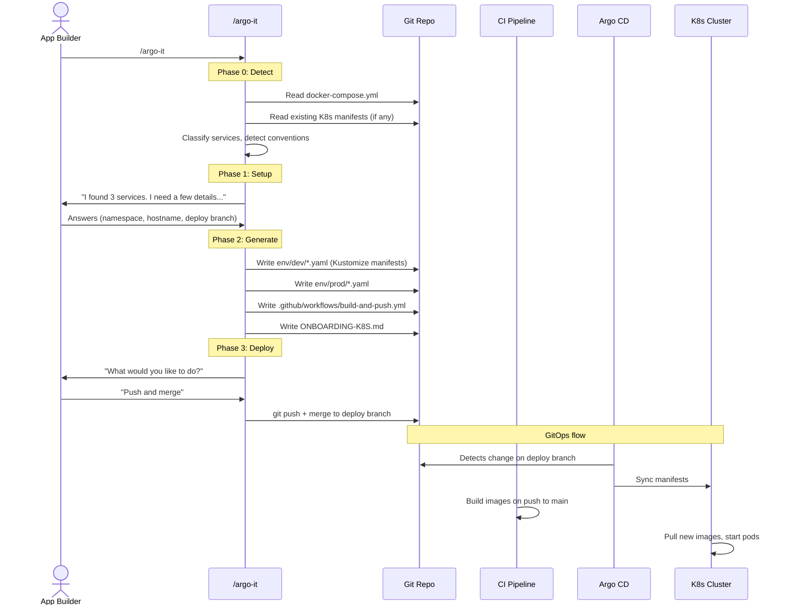
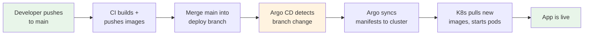
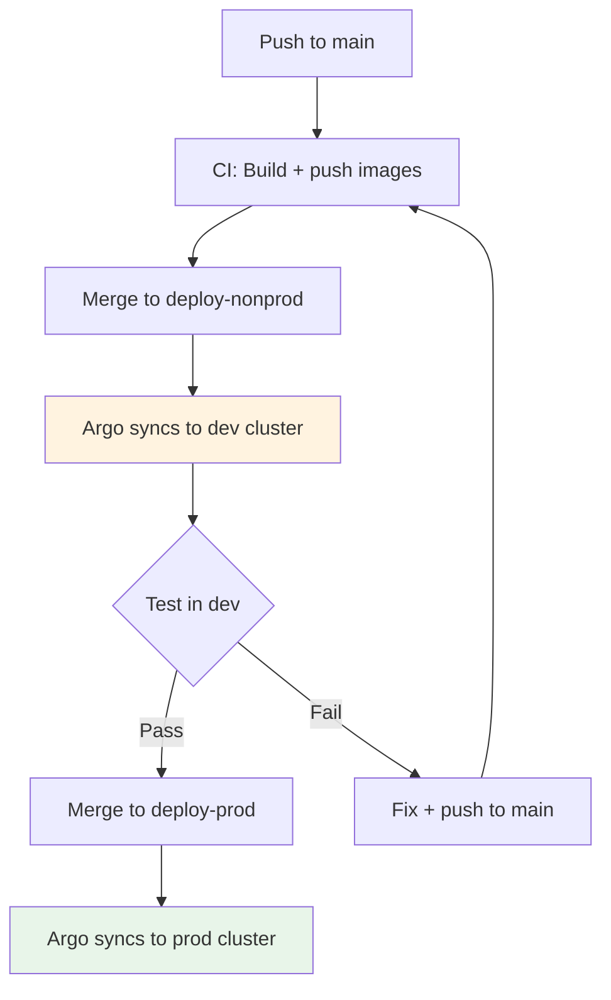
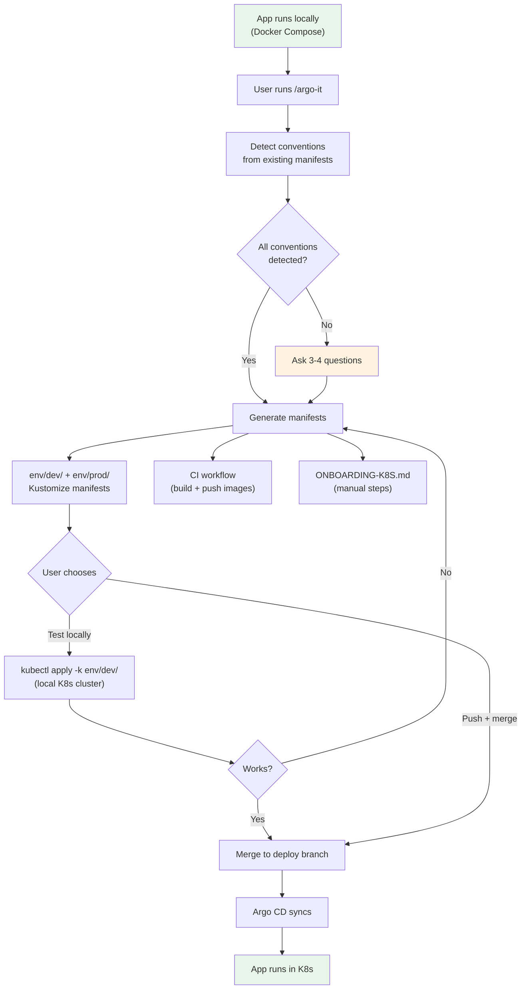

# DevOps Guide: /argo-it -- Kubernetes Deployment via Argo CD

A user built an app with `/make-it`. It runs locally in Docker Compose. Now they want it running in your Kubernetes cluster. `/argo-it` generates the Kustomize manifests, CI workflow, and onboarding docs to make that happen via Argo CD.

This guide explains what `/argo-it` produces, what it expects from your cluster, and what you need to support.

---

## What Is /argo-it?

`/argo-it` is a Claude Code skill that converts a Docker Compose application into Kubernetes manifests for deployment via Argo CD. The user types `/argo-it` from their project directory -- the skill reads their `docker-compose.yml`, detects your cluster's conventions, and generates everything needed for GitOps deployment.

**What it does:**
- Reads `docker-compose.yml` to understand services, ports, volumes, env vars
- Detects existing K8s conventions from manifests already in the repo (registry, ingress, storage, secrets)
- Generates Kustomize manifests for dev and prod (`env/dev/`, `env/prod/`)
- Generates a CI workflow for building and pushing container images
- Generates `ONBOARDING-K8S.md` with manual setup steps
- Offers to push and merge to the deploy branch

**What it does NOT do:**
- Modify application code or Docker Compose files
- Apply manifests to the cluster (Argo CD does that)
- Create namespaces, secrets, or Argo Applications
- Manage databases or mock services in K8s

---

## Why Not Just Use Kompose?

[Kompose](https://kompose.io/) converts Docker Compose to K8s manifests mechanically -- one resource per Compose directive. The results need significant manual cleanup for production use.

`/argo-it` is smarter:

| Kompose | /argo-it |
|---------|---------|
| Converts everything literally | Classifies services (app vs database vs mock) |
| Generates for databases and mocks | Skips databases and mocks (handled separately in K8s) |
| Generic Ingress | Detects your ingress controller (Traefik IngressRoute, nginx, ALB) |
| No secret management awareness | Classifies env vars as secret vs config, generates SecretKeyRef |
| No CI/CD integration | Generates CI workflow for image build + push |
| One-shot conversion | Generates separate dev/prod manifests with env-specific values |
| No onboarding docs | Generates ONBOARDING-K8S.md with manual steps |

---

## How It Works



---

## What Gets Generated

### Directory Structure

```
my-app/
  env/
    dev/
      kustomization.yaml          # Kustomize config (namespace, resource list)
      backend.yaml                # Deployment (backend service)
      frontend.yaml               # Deployment (frontend service)
      backend-service.yaml        # Service (ClusterIP)
      frontend-service.yaml       # Service (ClusterIP)
      my-app-ingress.yaml         # IngressRoute or Ingress (web-facing service)
      my-app-pvc.yaml             # PersistentVolumeClaim (if volumes exist)
      my-app-external-secret.yaml # ExternalSecret (if ESO available)
    prod/
      (same files, prod values)
  .github/workflows/
    build-and-push.yml            # CI for image build + push
  ONBOARDING-K8S.md              # Manual setup steps
```

### Service Classification

`/argo-it` doesn't blindly convert every Docker Compose service:

| Docker Compose Service | K8s Manifest? | Why |
|----------------------|---------------|-----|
| `backend` (FastAPI) | Yes -- Deployment + Service | App service |
| `frontend` (Next.js) | Yes -- Deployment + Service + Ingress | Web-facing app service |
| `db` (PostgreSQL) | No | Use managed DB or existing cluster DB |
| `mock-oidc` | No | Local dev only -- real OIDC in K8s |
| `mock-jira` | No | Local dev only -- real API in K8s |
| `worker` (Celery) | Yes -- Deployment only (no Service) | Background worker |

### Example: Generated Deployment

```yaml
apiVersion: apps/v1
kind: Deployment
metadata:
  name: backend
  labels:
    app: backend
spec:
  replicas: 1
  selector:
    matchLabels:
      app: backend
  template:
    metadata:
      labels:
        app: backend
    spec:
      # Init container for database migrations
      initContainers:
      - name: backend-migrate
        image: ghcr.io/your-org/my-app/backend:dev-latest
        command: ["python", "-m", "alembic", "upgrade", "head"]
        env:
          - name: DATABASE_URL
            valueFrom:
              secretKeyRef:
                name: my-app-secrets-dev
                key: DATABASE_URL
      containers:
      - name: backend
        image: ghcr.io/your-org/my-app/backend:dev-latest
        imagePullPolicy: Always
        ports:
          - containerPort: 8000
        env:
          # Secrets -> secretKeyRef (never hardcoded)
          - name: DATABASE_URL
            valueFrom:
              secretKeyRef:
                name: my-app-secrets-dev
                key: DATABASE_URL
          - name: OIDC_CLIENT_SECRET
            valueFrom:
              secretKeyRef:
                name: my-app-secrets-dev
                key: OIDC_CLIENT_SECRET
          # Config -> literal values
          - name: APP_ENV
            value: "dev"
          - name: OIDC_ISSUER_URL
            value: "https://login.microsoftonline.com/tenant-id/v2.0"
```

### Example: Generated Traefik IngressRoute

When Traefik is detected (preferred in many environments):

```yaml
apiVersion: traefik.io/v1alpha1
kind: IngressRoute
metadata:
  name: my-app-ingress
  namespace: my-team-projects
spec:
  entryPoints:
    - websecure
  routes:
    - match: Host(`my-app-dev.example.com`)
      kind: Rule
      services:
        - name: frontend-service
          port: 3000
  tls:
    secretName: my-app-tls-dev
```

For clusters using standard Kubernetes Ingress (nginx, ALB), it generates the appropriate `kind: Ingress` with controller-specific annotations instead.

### Example: Generated CI Workflow

The generated `build-and-deploy.yml` handles the **full pipeline** from source push through to Argo CD deploy:

```yaml
name: Build and Deploy

on:
  push:
    branches-ignore: [deploy-nonprod, deploy-prod]   # Prevent infinite loop
  pull_request:

permissions:
  contents: write     # Push to deploy branch
  packages: write     # Push to container registry

concurrency:
  group: deploy-nonprod
  cancel-in-progress: false    # Don't cancel in-progress deploys

jobs:
  build-and-publish:
    runs-on: ubuntu-latest
    if: github.ref_name != 'deploy-nonprod'   # Guard against infinite loop
    steps:
      # --- Setup ---
      - uses: actions/checkout@v4
        with: { fetch-depth: 0 }
      - uses: docker/setup-buildx-action@v3
      - uses: docker/login-action@v3
        with:
          registry: ghcr.io
          username: ${{ github.actor }}
          password: ${{ secrets.GITHUB_TOKEN }}

      # --- Build + Push ---
      - uses: docker/metadata-action@v5     # Compute image tags (sha, branch, latest)
        id: meta
      - uses: docker/build-push-action@v6
        with:
          context: ./backend
          push: ${{ github.event_name != 'pull_request' }}   # Push only on non-PR
          tags: ghcr.io/your-org/my-app/backend:dev-latest

      - uses: docker/build-push-action@v6
        with:
          context: ./frontend
          push: ${{ github.event_name != 'pull_request' }}
          tags: ghcr.io/your-org/my-app/frontend:dev-latest

      # --- Deploy (non-PR only) ---
      - if: github.event_name != 'pull_request'
        uses: actions/checkout@v4
        with:
          ref: deploy-nonprod
          path: deploy

      - if: github.event_name != 'pull_request'
        run: |
          # Mirror source → deploy branch
          rsync -a --delete --exclude='.git' --exclude='deploy' ./ deploy/
          # Patch image tags in K8s manifests
          cd deploy
          yq -i '.spec.template.spec.containers[0].image = "ghcr.io/your-org/my-app/backend:dev-latest"' env/dev/backend.yaml
          yq -i '.spec.template.spec.containers[0].image = "ghcr.io/your-org/my-app/frontend:dev-latest"' env/dev/frontend.yaml
          # Commit and push (triggers Argo CD sync)
          git config user.name "ci-bot"
          git config user.email "ci@noreply"
          git add -A
          git diff --staged --quiet || git commit -m "deploy: $(git -C .. rev-parse --short HEAD)"
          git push origin deploy-nonprod
```

**Key design decisions in the generated workflow:**

| Decision | Why |
|----------|-----|
| `branches-ignore: [deploy-*]` | Prevents deploy branch push from re-triggering CI (infinite loop) |
| `contents: write` permission | Needed to push to deploy branch |
| `concurrency` with `cancel-in-progress: false` | Prevents parallel deploys that could corrupt the deploy branch |
| PR builds don't push | PRs are validation gates — no image push, no deploy branch edits |
| `rsync` mirror | Deploy branch gets full source (not just manifests) — enables Argo CD to reference any file |
| `yq` for tag patching | YAML-safe editing (not sed/grep) — preserves comments and structure |
| `ci-bot` commit | Distinguishes automated commits from human ones |

---

## What /argo-it Needs From Your Cluster

### Required Infrastructure

| Component | What's needed | Who provides it |
|-----------|--------------|----------------|
| **Namespace** | Team namespace (e.g., `my-team-projects`) | Compute/infra team creates on request |
| **Argo CD Project** | One per team, apps live within | DevOps creates per team |
| **Argo CD Application** | Points to repo + deploy branch + manifest path | DevOps creates per app |
| **Container registry access** | Cluster can pull from ghcr.io (or your registry) | Cluster-level config (ghcr.io typically pre-configured) |
| **Ingress controller** | Traefik, nginx, ALB, or Istio | Already running in cluster |

### Required Secrets (Per App)

| Secret | Contents | Created by |
|--------|---------|-----------|
| **App secrets** (`{app}-secrets-{env}`) | DATABASE_URL, OIDC_CLIENT_SECRET, API keys | App owner via Rancher UI or External Secrets Operator |
| **TLS cert** (`{app}-tls-{env}`) | TLS certificate + private key for the app's hostname | App owner generates CSR, PKI signs, kubectl creates secret |
| **Image pull secret** (if non-default registry) | Registry credentials | DevOps (ghcr.io typically pre-configured at cluster level) |

### Secret Management Paths

`/argo-it` supports two secret management approaches in the generated onboarding doc:

**Option A: Manual (Quick Start)**
```bash
kubectl create secret generic my-app-secrets-dev \
  --from-literal=DATABASE_URL='postgresql://...' \
  --from-literal=OIDC_CLIENT_SECRET='...' \
  -n my-team-projects
```
Created via Rancher UI or kubectl. Simple, immediate, good for getting started.

**Option B: External Secrets Operator (Production)**
```yaml
apiVersion: external-secrets.io/v1beta1
kind: ExternalSecret
metadata:
  name: my-app-secrets-dev
  namespace: my-team-projects
spec:
  refreshInterval: 1h
  secretStoreRef:
    name: my-team-secret-store
    kind: SecretStore
  target:
    name: my-app-secrets-dev
  data:
    - secretKey: DATABASE_URL
      remoteRef:
        key: /my-team/my-app/dev
        property: DATABASE_URL
```

If ESO is available and the namespace is onboarded, `/argo-it` generates the ExternalSecret manifest. Otherwise, it documents manual creation in ONBOARDING-K8S.md.

---

## Deployment Flow (GitOps)



**Automated deployment pipeline:**
1. **Developer pushes to `main`** -- CI builds and pushes container images to registry
2. **CI mirrors source to deploy branch** -- `rsync` copies full source tree, `yq` patches image tags in manifests
3. **CI pushes deploy branch** -- Argo CD detects the change
4. **Argo CD syncs** -- Applies Kustomize manifests to the cluster, K8s pulls new images

The deploy branch update is fully automated — developers never manually merge to deploy branches.

### Branch Strategy

```
main                    <- App code lives here. CI builds images on push.
  |
  +-- deploy-nonprod    <- Argo CD watches this for dev. Merge main to deploy.
  |
  +-- deploy-prod       <- Argo CD watches this for prod. Merge after dev verified.
```

### Multi-Environment Flow



---

## Ingress Controller Support

`/argo-it` detects your cluster's ingress controller and generates the right manifest type:

| Controller | Manifest type | Detection |
|-----------|--------------|-----------|
| **Traefik IngressRoute** | `traefik.io/v1alpha1 IngressRoute` CRD | Existing IngressRoute in repo, or user specifies |
| **Traefik (standard)** | `networking.k8s.io/v1 Ingress` with Traefik annotations | Traefik annotations in existing Ingress |
| **nginx** | `networking.k8s.io/v1 Ingress` with nginx annotations | nginx annotations in existing Ingress |
| **AWS ALB** | `networking.k8s.io/v1 Ingress` with ALB annotations | ALB annotations in existing Ingress |
| **Istio** | `networking.istio.io/v1 VirtualService` | Istio CRDs in cluster |
| **None** | ClusterIP Service only (no external access) | User specifies |

**Traefik IngressRoute is preferred** when Traefik is available -- it provides direct control over entrypoints (e.g., `websecure`) and middleware chains.

### TLS Certificates

`/argo-it` assumes per-app certificates (not wildcards). The generated `ONBOARDING-K8S.md` documents the cert provisioning process:

1. Generate a CSR for the app's hostname
2. Submit through your org's cert process (e.g., ServiceNow ticket to internal PKI)
3. Create a K8s TLS secret with the signed cert:
   ```bash
   kubectl create secret tls my-app-tls-dev \
     --cert=cert.pem --key=key.pem -n my-team-projects
   ```
4. Certs are typically valid for 1 year -- set a renewal reminder

---

## Database Migrations

`/argo-it` uses **init containers** for database migrations (not K8s Jobs):

```yaml
initContainers:
- name: backend-migrate
  image: ghcr.io/your-org/my-app/backend:dev-latest
  command: ["python", "-m", "alembic", "upgrade", "head"]
  env:
    - name: DATABASE_URL
      valueFrom:
        secretKeyRef:
          name: my-app-secrets-dev
          key: DATABASE_URL
```

**Why init containers instead of Jobs:**
- No cluster-level RBAC needed (Jobs require additional permissions)
- Same image as the main container, different command
- Runs before the app starts -- pod won't accept traffic until migration completes
- Works with any migration framework (Alembic, Django, Prisma, Knex)

**Database access:**
- The database is NOT inside the K8s cluster (unless your team runs StatefulSets)
- Typically a managed database service (RDS, Azure SQL, Cloud SQL) or existing shared DB
- Connection string is in the app's K8s Secret (`DATABASE_URL`)

---

## Convention Detection

The key feature of `/argo-it` is that it **reads before it asks**. If your repo (or a sibling repo) already has K8s manifests, it extracts conventions automatically:

| Convention | How it's detected | Example |
|-----------|------------------|---------|
| Registry | Image field in existing Deployment | `ghcr.io/your-org/` |
| Image tag strategy | Tag in existing image field | `dev-latest`, `v1.2.3` |
| Ingress type | `kind: IngressRoute` or Ingress annotations | Traefik IngressRoute |
| Hostname pattern | `host:` or `match:` in existing ingress | `*-dev.example.com` |
| Storage class | `storageClassName` in existing PVC | `longhorn`, `gp3` |
| Secret naming | `secretKeyRef.name` in existing env vars | `{app}-secrets-{env}` |
| Namespace | Kustomization or metadata namespace | `my-team-projects` |
| Deploy branch | `git branch -r \| grep deploy` | `deploy-nonprod` |
| CI system | Presence of `.github/workflows/`, `.gitlab-ci.yml`, etc. | GitHub Actions |

**If conventions are detected, the user answers fewer questions** (sometimes zero). If nothing is detected, `/argo-it` asks 3-4 questions and uses sensible defaults.

---

## Local K8s Testing

Before merging to the deploy branch, users can test manifests on a local K8s cluster:

```bash
# Build images locally
docker compose build

# Apply manifests to local cluster
kubectl apply -k env/dev/

# Verify pods are running
kubectl get pods -n my-team-projects

# Clean up
kubectl delete -k env/dev/
```

Works with:
- **Rancher Desktop** (preferred -- uses same K3s as many production clusters)
- **minikube**
- **kind**
- **Docker Desktop Kubernetes**

This tests the exact same Kustomize manifests that Argo CD will use in the real cluster.

---

## What DevOps Needs to Do

### One-Time Setup (Per Team)

- [ ] Create team namespace (e.g., `my-team-projects`)
- [ ] Create Argo CD Project for the team
- [ ] Configure Argo CD Project: allowed repos, clusters, namespaces
- [ ] Onboard namespace to External Secrets Operator (if using ESO)
- [ ] Ensure cluster can pull from team's container registry

### Per-App Setup

- [ ] Create Argo CD Application pointing to repo + deploy branch + manifest path
- [ ] Create K8s Secrets (manual via Rancher, or ExternalSecret manifest)
- [ ] Create TLS Secret (after user gets cert signed)
- [ ] Verify Argo sync status after first merge

### Ongoing

- [ ] Monitor Argo CD sync status
- [ ] Rotate TLS certs annually
- [ ] Review resource usage if prod quotas are enforced
- [ ] Onboard new teams/namespaces as needed

---

## Process Flow: Docker Compose to K8s



---

## FAQ

### Does /argo-it replace /ship-it?

No. They serve different deployment targets:

| Skill | Deploys to | Uses |
|-------|-----------|------|
| `/ship-it` | Cloud container services (ECS, Cloud Run, ACA) | Terraform + CI/CD pipeline |
| `/argo-it` | Kubernetes clusters | Kustomize + Argo CD GitOps |

Some orgs use one, some use both. `/argo-it` is for teams that run their own K8s clusters.

### Does /argo-it talk to the Argo CD API?

No. `/argo-it` generates files and pushes to a git branch. Argo CD watches that branch and syncs automatically. There's no API communication between the skill and Argo.

### What if the user's app has 5+ services?

`/argo-it` generates one Deployment + Service per app service. It handles any number of services. Mock services and databases are always skipped.

### What if the user picks the wrong namespace?

The namespace is in `kustomization.yaml`. Change it there and merge -- Argo syncs the update. Manifests are just files in git.

### What if we use Helm instead of Kustomize?

`/argo-it` generates Kustomize manifests (plain YAML + kustomization.yaml). If your org standardizes on Helm, the generated manifests can be adapted to a Helm chart, but `/argo-it` doesn't generate Helm charts directly. The Kustomize approach was chosen for simplicity -- no templating language, just YAML with overlays.

### What if we don't use Argo CD?

The generated Kustomize manifests work with any GitOps tool (Flux, plain kubectl apply). The CI workflow works independently. The only Argo-specific part is the branch-based deploy strategy and the `ONBOARDING-K8S.md` Argo setup section.

### What about resource limits and quotas?

`/argo-it` generates manifests without resource limits by default (suitable for dev environments). For production with quotas enforced, add `resources.requests` and `resources.limits` to the Deployment manifests in `env/prod/` before merging.

### What about horizontal pod autoscaling?

Not generated by default. Add HPA manifests to `env/prod/` if needed -- Kustomize will pick them up automatically when listed in `kustomization.yaml`.

### What registries are supported?

| Registry | Pull secret needed? | Notes |
|---------|-------------------|-------|
| **ghcr.io** (GitHub) | Usually no (cluster-level creds) | Default for GitHub-hosted repos |
| **ECR** (AWS) | IAM-based | CI workflow uses `aws-actions/amazon-ecr-login` |
| **ACR** (Azure) | Service principal | CI workflow uses `azure/docker-login` |
| **Docker Hub** | Credentials secret | CI workflow uses `docker/login-action` |
| **Other** | Pull secret per namespace | User creates `imagePullSecret` |

### What if the user wants to deploy to multiple clusters?

Generate separate Argo Applications pointing to the same repo but different manifest paths (`env/dev/`, `env/prod/`). Each cluster's Argo CD watches its own environment path.

---

## Quick Reference: /argo-it Outputs

| Generated file | Purpose | DevOps action |
|----------------|---------|---------------|
| `env/dev/kustomization.yaml` | Kustomize config for dev | Point Argo Application here |
| `env/dev/*.yaml` | K8s manifests for dev | Review, adjust resource limits if needed |
| `env/prod/kustomization.yaml` | Kustomize config for prod | Point Argo Application here |
| `env/prod/*.yaml` | K8s manifests for prod | Review, add resource limits + HPA |
| `.github/workflows/build-and-push.yml` | CI for image build | Verify registry credentials work |
| `ONBOARDING-K8S.md` | Manual setup checklist | Follow the steps |

---

*For the overall /make-it and /ship-it deployment guide, see [DEVOPS-GUIDE.md](DEVOPS-GUIDE.md).*
