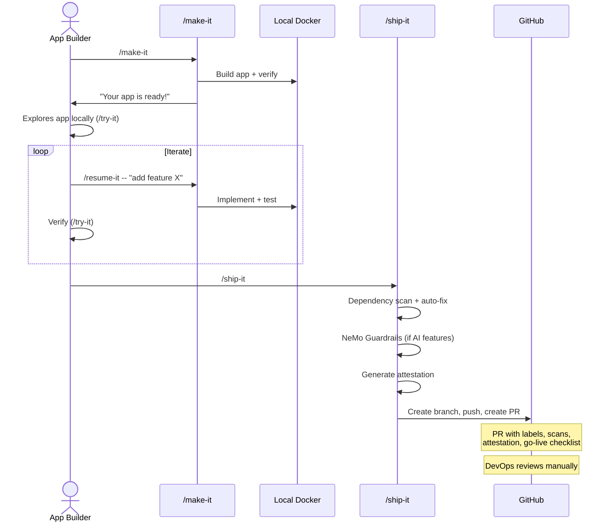
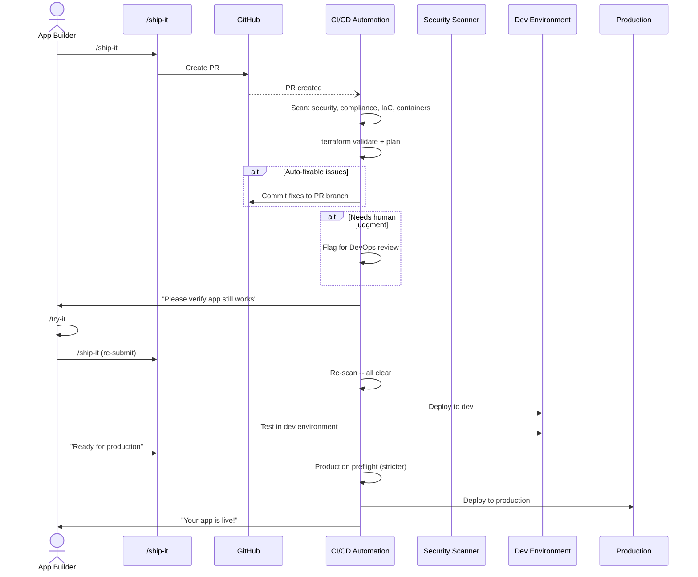
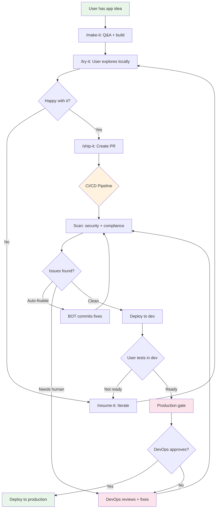

# DevOps Guide: What You Need to Know About /make-it and /ship-it

Your users are building apps with AI. They type commands, answer questions in plain English, and get working applications. Your job is to get those apps into production safely.

This guide explains what the platform does, how it works, what you need to support, and where the boundaries are between "their world" and yours.

---

## What Is This?

`/make-it` is a set of AI-powered skills inside Claude Code that let non-developers build web applications by describing what they want in plain English. The AI handles code generation, testing, security scanning, and packaging. The user never writes code.

**The skills:**

| Skill | What it does | DevOps relevance |
|-------|-------------|-----------------|
| `/make-it` | Builds an app from a conversation | Generates code, Docker Compose, Terraform artifacts |
| `/try-it` | Spins up the app locally for the user to explore | Local Docker only -- no infra impact |
| `/resume-it` | Continues work on an existing app | Auto-fixes security findings, runs tests |
| `/ship-it` | Packages and submits for deployment | Creates PR, runs scans, generates CI workflow |
| `/argo-it` | Deploys to Kubernetes via Argo CD | Generates K8s manifests (see [ARGO-IT-GUIDE.md](ARGO-IT-GUIDE.md)) |
| `/wrap-it` | Saves progress and shuts down | Local cleanup only -- no infra impact |

---

## Why Does This Exist?

**Problem:** Business teams have app ideas but no developers. IT backlogs are months long. Teams resort to spreadsheets, shadow IT, or waiting.

**Solution:** Business users describe what they want, AI builds it to enterprise standards (auth, RBAC, security, Docker, tests), and DevOps deploys it through the normal pipeline.

**What changes for DevOps:**
- More apps coming through the pipeline (that's the point)
- Apps arrive pre-scanned and pre-structured (consistent patterns)
- Every app follows the same architecture (predictable to operate)
- Terraform is generated as a handoff artifact (you review and apply, never the user)

**What doesn't change:**
- You still own the deployment pipeline
- You still approve production deployments
- You still manage infrastructure
- You still handle secrets, networking, and access control

---

## How an App Gets Built

The user's journey is simple. The technical details happen invisibly.

```
 User: "I want a dashboard that tracks support tickets by team"
       |
       v
   /make-it          User answers 5-10 questions in plain English
       |
       v
   AI builds app     Code, database, auth, RBAC, Docker, tests
       |              (all generated to a standard blueprint)
       v
   Build-verify      AI silently starts the app, tests auth/API/pages
       |              fixes any issues before user sees anything
       v
   /try-it           User explores app in browser (localhost)
       |
       v
   /resume-it        User iterates: "add a chart", "make it blue"
       |              (security scan auto-fix happens here too)
       v
   /ship-it          Creates PR with scans, workflow, attestation
       |
       v
   DevOps pipeline   Your world starts here
```

---

## What Every App Looks Like

Every app built by `/make-it` follows the same architecture. No exceptions.

### Stack (Web Apps)

| Layer | Technology | Why |
|-------|-----------|-----|
| Backend | FastAPI (Python) | Async, fast, OpenAPI spec auto-generated |
| Frontend | Next.js (TypeScript) | React, server-side rendering, same-origin proxy |
| Database | PostgreSQL | Managed via Alembic migrations |
| Auth | OIDC (configurable provider) | Azure AD, Okta, Auth0, Keycloak, etc. |
| Containers | Docker Compose | Multi-service orchestration with health checks |
| Mock services | mock-oidc + per-integration mocks | Local dev only, never deployed |

### What's Included in Every App

| Component | What it is |
|-----------|-----------|
| **OIDC authentication** | Login flow with configurable provider. Mock OIDC for local dev. |
| **Database-driven RBAC** | 4 tables (roles, permissions, role_permissions, users). Permission middleware on every route. |
| **4 system roles** | Super Admin, Admin, Manager, User -- seeded in migration |
| **Activity logging** | Request logging middleware, REST API, admin UI page |
| **Docker Compose** | Backend, frontend, PostgreSQL, mock-oidc. Health checks on all services. |
| **Alembic migrations** | Database schema management with up/down migrations |
| **Test infrastructure** | pytest (backend), Playwright scaffolding (e2e) |
| **Environment config** | `.env` / `.env.example` -- no hardcoded secrets |

### File Structure (Predictable)

```
my-app/
  backend/
    app/
      routers/         # API endpoints
      models/          # SQLAlchemy models
      schemas/         # Pydantic schemas
    alembic/           # Database migrations
    Dockerfile
  frontend/
    app/               # Next.js pages
    components/        # React components
    Dockerfile
  mock-services/       # Local dev only (never deployed)
  infrastructure/      # Terraform (DevOps handoff artifact)
  docker-compose.yml
  .env.example
  .ship-it.yml         # Deployment config (DevOps fills infra section)
```

---

## The Build Standard

Every app is verified against a checklist of ~40 checks before the user ever sees it. These checks cover:

| Category | Examples | Severity |
|----------|---------|----------|
| **Structure** | Git initialized, .gitignore correct, CHANGELOG.md exists | BLOCK |
| **Auth** | OIDC flow works, roles from database (not claims), logout via POST | BLOCK |
| **RBAC** | 4 tables exist, permissions seeded, middleware on all routes | BLOCK |
| **Database** | Alembic migrations run, seed data loads, no raw SQL | FIX |
| **Docker** | Health checks use 127.0.0.1, .env.example complete | FIX |
| **Security** | No secrets in code, input validation, parameterized queries | BLOCK |
| **UI** | Standard components, system fonts only, responsive | WARN |

**BLOCK** = must pass before PR. **FIX** = auto-fixed. **WARN** = noted in TODO.

The full checklist is in `build-standards.md`. When new checks are added, `/resume-it` detects the gap on existing apps and applies the missing patterns.

---

## Security Scanning

### What Happens During Build (Automatic)

| Scan | When | What |
|------|------|------|
| **Dependency audit** | `/ship-it` | pip-audit (Python), npm audit (Node.js) -- auto-upgrades vulnerable packages |
| **Secret detection** | Build-verify | Scans for hardcoded keys, tokens, passwords in committed files |
| **NeMo Guardrails** | `/ship-it` (if AI features) | 60+ test cases: prompt injection, jailbreak, toxicity, PII leakage, hallucination |
| **OWASP patterns** | Build-verify | Input validation, parameterized queries, security headers |

### What Happens Post-Build (If Scanner Configured)

If your org has a security scanning platform (GitHub Advanced Security, Snyk, SonarQube, or custom):

```
Scanner scans repo (on push or schedule)
  -> Creates GitHub Issues for findings
  -> User runs /resume-it
     -> /resume-it reads Issues, calls scanner API
     -> Downloads AI-generated remediation diffs
     -> Applies fixes, runs tests
     -> Pushes fix, marks finding resolved
     -> Scanner rescans, confirms fix, auto-closes Issue
```

**The user never sees security findings.** They only get "I made some updates to keep your app secure -- can you check everything still works?"

### AI Safety Attestation

Apps with AI features get a formal attestation document (`docs/attestations/YYYY-MM-DD-vN.md`) with:
- Pass/fail per NeMo Guardrails category
- Test details and any unresolved findings
- This is the GRC-required acceptance qualification for production

---

## What /ship-it Produces

When the user types `/ship-it`, here's what lands in your pipeline:

### The PR

| PR Component | What's in it |
|-------------|-------------|
| **Branch** | `ship/{app-slug}-{intent}` |
| **Labels** | `ship-it`, `intent:experiment` or `intent:shareable` or `intent:prod-ready` |
| **Description** | App summary, services, security audit results, AI attestation summary |
| **Go-live checklist** | What's done, what DevOps needs to do |
| **Reviewers** | From `.ship-it.yml` or org defaults |

### The Config File (.ship-it.yml)

This is the contract between the app and your pipeline:

```yaml
# APP section -- auto-populated by /make-it
app:
  name: "Support Dashboard"
  slug: "support-dashboard"
  stack: "fastapi-nextjs"
  services:
    - name: backend
      dockerfile: backend/Dockerfile
      port: 8000
      health_check: /health
    - name: frontend
      dockerfile: frontend/Dockerfile
      port: 3000
      health_check: /

# INFRA section -- YOU fill this in
infra:
  provider: aws              # aws | azure | ""
  aws:
    region: us-east-1
    ecr_registry: "123456789012.dkr.ecr.us-east-1.amazonaws.com"

# DEPLOYMENT section -- shared ownership
deployment:
  environments:
    dev: dev
    production: production
  reviewers:
    - devops-lead
```

**Your responsibility:** Fill in the `infra` section after the first PR. Everything else is auto-populated.

### Generated CI Workflow

`/ship-it` generates a GitHub Actions workflow (`.github/workflows/`) that:
1. Builds Docker images for each service
2. Pushes to the configured registry
3. References your org's reusable workflow (if configured in `.ship-it.yml`)

### Terraform Artifacts

If the app needs cloud resources, Terraform is generated in `infrastructure/`:

```
infrastructure/
  main.tf            # Cloud resources
  variables.tf       # Configurable values
  outputs.tf         # Connection strings, URLs
  versions.tf        # Provider constraints
  backend.tf         # State backend
  environments/      # Per-environment tfvars
```

**The user never runs Terraform.** It's a handoff artifact for your team to review and apply.

---

## Deployment Lifecycle

### Current State (What Works Today)



**Gap:** No automated CI/CD pipeline after PR creation. DevOps reviews and deploys manually.

### Target State (Full Automation)



### What DevOps Needs to Build (Target State)

| Component | What it does | Priority |
|-----------|-------------|----------|
| **PR scan workflow** | GitHub Actions that triggers on /ship-it PRs | High |
| **Auto-remediation** | Commit dependency/lint fixes to PR branch | High |
| **Terraform pipeline** | `validate` + `plan` on PR, `apply` on merge | Medium |
| **Dev deploy pipeline** | Deploy to dev environment after PR merge | High |
| **Prod deploy pipeline** | Deploy to prod with approval gate | Medium |
| **Reusable workflow** | Shared workflow referenced by generated caller workflows | High |

The CI/CD contract is fully defined in `ship-it-guide.md` -- it specifies triggers, check categories, remediation flow, and communication patterns.

---

## What DevOps Owns vs What's Automated

| Responsibility | Owner | Notes |
|---------------|-------|-------|
| App code generation | AI (automated) | User describes, AI builds |
| Local testing | AI + User | Docker Compose sandbox |
| Security scanning (local) | AI (automated) | pip-audit, npm audit, NeMo |
| PR creation | `/ship-it` (automated) | Branch, labels, reviewers |
| CI/CD pipeline | **DevOps** | Scan, remediate, deploy |
| Infrastructure provisioning | **DevOps** | Terraform review + apply |
| Secret management | **DevOps** | K8s Secrets, vault, ESO |
| Namespace creation | **DevOps** | Per team request |
| OIDC provider configuration | **DevOps** | Register app in Azure AD / Okta / etc. |
| TLS certificates | **DevOps + User** | User submits CSR, PKI signs |
| Production approval | **DevOps** | Final gate before prod deploy |
| Monitoring / alerting | **DevOps** | Post-deploy operational |

---

## Process Flow: App Idea to Production



---

## Handling Variants

### Different Stacks

Most apps are FastAPI + Next.js (the scaffold). But users might describe apps that need different stacks:

| Stack | How /make-it handles it | What DevOps sees |
|-------|------------------------|-----------------|
| FastAPI + Next.js | Pre-built scaffold (98 files) | Standard, predictable |
| Flask + Jinja2 | Generated from templates | Similar Docker pattern |
| Express + React | Generated from templates | Similar Docker pattern |
| CLI tool | No Docker Compose | Just code + tests |
| IDE extension | No Docker Compose | Just code + packaging |

**Key point:** Docker Compose structure is consistent regardless of stack. Backend, frontend, database -- same pattern.

### Different Auth Providers

| Provider | What changes | DevOps action |
|----------|-------------|---------------|
| Azure AD | OIDC endpoints point to Azure | Register app in Azure AD, provide client ID/secret |
| Okta | OIDC endpoints point to Okta | Register app in Okta |
| Auth0 | OIDC endpoints point to Auth0 | Register app in Auth0 |
| Keycloak | OIDC endpoints point to Keycloak | Ensure Keycloak is accessible |

The app code is identical -- only environment variables change. Auth provider is chosen during `/make-it` design phase.

### Different Cloud Providers

| Provider | Terraform generated for | Registry |
|----------|------------------------|----------|
| AWS | ECS, RDS, S3, CloudWatch | ECR |
| Azure | AKS, Azure SQL, Blob Storage | ACR |
| None specified | Placeholder Terraform | ghcr.io default |

---

## FAQ

### Why Docker Compose instead of just a Dockerfile?

Every `/make-it` app is a **multi-service application**, not a single container:

| Service | Why it's separate |
|---------|------------------|
| **Backend** (FastAPI) | API server, handles auth, business logic |
| **Frontend** (Next.js) | Web UI, server-side rendering, static assets |
| **Database** (PostgreSQL) | Persistent data storage |
| **mock-oidc** | Local auth provider for development (never deployed) |
| **Mock integrations** | Fake Jira/Tempo/Slack APIs for local dev (never deployed) |

A single Dockerfile can only build one service. Docker Compose orchestrates all of them with:
- **Health checks** between services (backend waits for database)
- **Networking** (services discover each other by name)
- **Volume management** (database data persists across restarts)
- **Environment variables** (shared `.env` file)
- **Dev profiles** (mock services only in dev, not in production)

```
docker-compose.yml
  |
  +-- backend         (Dockerfile)    --> Deployed
  +-- frontend        (Dockerfile)    --> Deployed
  +-- db              (postgres:16)   --> Managed DB in prod (RDS, Azure SQL, etc.)
  +-- mock-oidc       (dev profile)   --> NOT deployed (real OIDC in prod)
  +-- mock-jira       (dev profile)   --> NOT deployed (real Jira API in prod)
```

**Bottom line:** Docker Compose is the local development environment. In production, only the app services (backend + frontend) are deployed as containers. Databases become managed services. Mock services disappear.

### Containers vs Kubernetes -- When Do You Need What?

| Stage | What runs | Where |
|-------|----------|-------|
| **Local dev** | Docker Compose | Developer's laptop |
| **Simple deploy** | Docker containers | ECS, Cloud Run, Azure Container Apps |
| **K8s deploy** | K8s pods (from same images) | Your K8s cluster via Argo CD |

The **same Docker images** work everywhere. The difference is orchestration:

| Approach | Best for | Managed by |
|----------|---------|-----------|
| **Docker Compose** | Local development, single-server deploys | Developer |
| **ECS / Cloud Run** | Cloud-native, auto-scaling, no cluster management | Cloud provider |
| **Kubernetes** | Multi-app clusters, GitOps, advanced networking | Your K8s team |

`/ship-it` targets cloud container services (ECS, Cloud Run, ACA).
`/argo-it` targets Kubernetes clusters via Argo CD.

They're not mutually exclusive -- some orgs use ECS for simple apps and K8s for complex ones.

**When to use /argo-it instead of /ship-it:**
- Your org runs a K8s cluster (Rancher, EKS, AKS, GKE)
- You use Argo CD for GitOps deployments
- You want Kustomize manifests (env/dev, env/prod) in the repo
- You want merge-to-deploy (push to branch = Argo syncs)

See [ARGO-IT-GUIDE.md](ARGO-IT-GUIDE.md) for the full Kubernetes deployment guide.

### What If an App Needs Something Non-Standard?

The build standard covers 90% of web apps. For edge cases:

| Situation | How it's handled |
|-----------|-----------------|
| Custom OIDC provider | User specifies during Q&A, env vars change |
| Non-PostgreSQL database | Supported (MySQL, MongoDB, etc.) -- Docker Compose + Terraform adapt |
| WebSocket requirements | Build standard includes WebSocket support |
| Cron jobs / background workers | Generated as separate Docker service |
| External API integrations | Mock service generated for local dev, real API in prod |
| GPU / ML workloads | Outside current scope -- flag for custom architecture |

### What If the User Breaks Something?

They can't. Here's why:

1. **Build-verify** catches issues before the user sees the app
2. **`/resume-it`** auto-fixes security findings
3. **`/ship-it`** scans again before creating the PR
4. **CI/CD pipeline** scans again before deploying
5. **The user never directly modifies code** -- they describe what they want

If the AI generates something problematic, it's caught at one of these four gates.

### What Does DevOps Need to Do for a New App?

**First time (one-time setup):**
1. Review the PR from `/ship-it`
2. Fill in the `infra` section of `.ship-it.yml`
3. Register the app with your OIDC provider (Azure AD, Okta, etc.)
4. Create K8s secrets (if using `/argo-it`) or configure cloud secrets
5. Apply Terraform (if cloud resources needed)
6. Approve deployment

**Subsequent deploys:**
1. Review the PR
2. CI/CD pipeline handles the rest (target state)

### How Do I Know What's in an App Without Reading the Code?

| File | What it tells you |
|------|------------------|
| `.ship-it.yml` | Services, ports, health checks, database, auth provider |
| `app-context.json` | Full design decisions, integrations, AI features |
| `docker-compose.yml` | All services, ports, volumes, dependencies |
| `.env.example` | Every environment variable the app needs |
| `ONBOARDING-K8S.md` | K8s-specific setup steps (if `/argo-it` was run) |
| `CHANGELOG.md` | What was built and changed |
| `TODO.md` | What's pending |
| `docs/attestations/` | AI safety attestation (if AI features) |

---

## Quick Reference: DevOps Checklist for a New App

- [ ] PR arrives from `/ship-it` -- review labels and description
- [ ] Check `.ship-it.yml` -- fill in `infra` section if empty
- [ ] Check `docker-compose.yml` -- understand services and ports
- [ ] Check `.env.example` -- understand required secrets
- [ ] Register app with OIDC provider (get client ID + secret)
- [ ] Create secrets in target environment (K8s, vault, cloud)
- [ ] Review Terraform in `infrastructure/` (if present)
- [ ] Apply Terraform to provision cloud resources
- [ ] Approve and merge PR
- [ ] Verify deployment health checks pass
- [ ] Share production URL with the user

---

*This guide covers /make-it and /ship-it. For Kubernetes deployment via Argo CD, see [ARGO-IT-GUIDE.md](ARGO-IT-GUIDE.md).*
