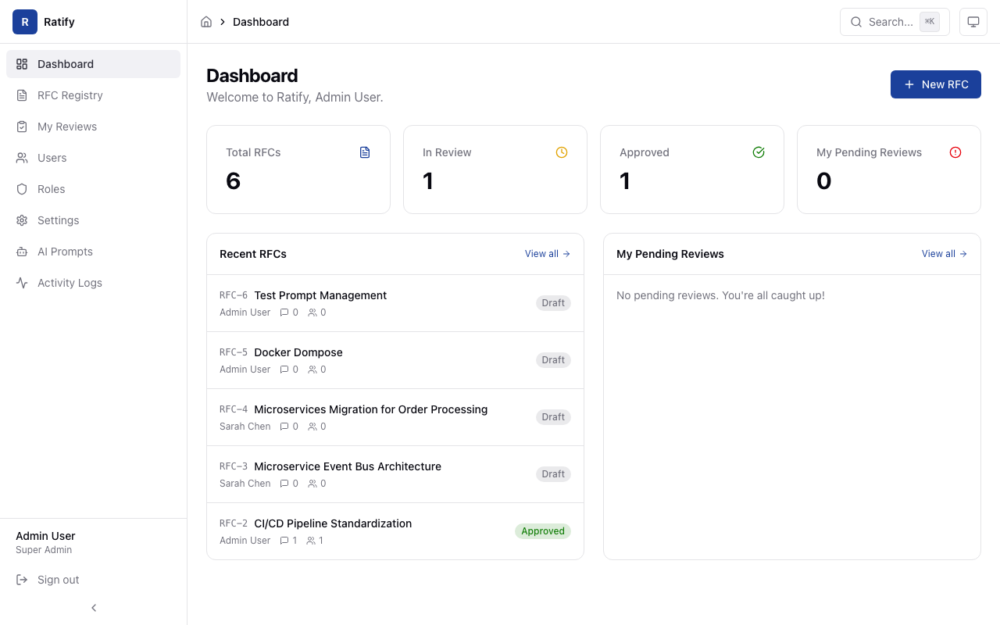
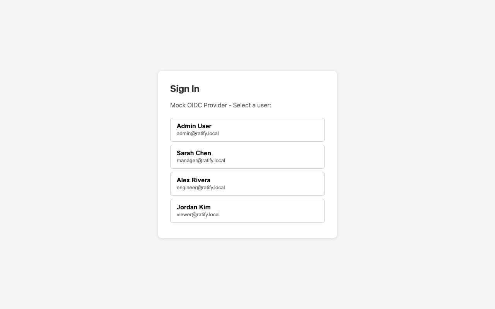

# Build Apps With Your Words, Not Code

You have an idea for an app. Maybe it's a dashboard for your team, a tool to track projects, or something that connects to Jira and gives you better reports.

You don't need to know how to code. You just need to describe what you want.

---

## How It Works

You type commands. An AI builds your app. That's it.

There are four commands, and you use them in order:

| Step | Command | What it does |
|------|---------|-------------|
| 1 | `/make-it` | Builds your app from a conversation |
| 2 | `/try-it` | Opens your app in a browser so you can explore it |
| 3 | `/resume-it` | Comes back later to make changes or add features |
| 4 | `/ship-it` | Puts your app live so others can use it |

That's the whole process. Let's walk through each one.

---

## Step 1: `/make-it` — Describe Your App

Open Claude Code and type:

```
/make-it
```

You'll be asked a few questions in plain English:

- **"What problem are you trying to solve?"**
- **"Who's going to use this app?"**
- **"What are the most important things it should do?"**
- **"What do you want to call it?"**

Answer in your own words. There are no wrong answers.

<!-- Screenshot: ideation-conversation.png — showing the Q&A conversation -->


After a few questions, you'll see a summary of what's about to be built. Confirm it looks right, and the build starts automatically.

<!-- Screenshot: build-progress.png — showing "Building your app..." progress messages -->


**This takes a few minutes.** You'll see friendly progress updates. Behind the scenes, your entire app is being created — login system, database, pages, permissions, everything.

When it's done, it automatically moves to the next step.

---

## Step 2: `/try-it` — See Your App

Your app opens in your browser. No setup required.

<!-- Screenshot: app-dashboard.png — showing a working dashboard with real data -->


You'll get instructions on how to explore:

- **Sign in** as different types of users (admin, manager, regular user)
- **Click through** every page
- **See real sample data** — not empty screens

<!-- Screenshot: try-it-login.png — showing the test user picker -->


**If something doesn't look right,** just describe what you see:

> "The dashboard looks empty"
> "I can't click the save button"
> "Can you make the header blue?"

It gets fixed on the spot. Keep exploring until you're happy with how it works.

---

## Step 3: `/resume-it` — Come Back and Change Things

Close your laptop. Come back tomorrow. Come back next week. When you're ready to make changes, type:

```
/resume-it
```

It remembers exactly where you left off and shows you what's been done, what's pending, and what to do next.

Use it to:

- **Add a new feature** — "I want a page that shows monthly reports"
- **Fix something** — "The search bar doesn't filter by date"
- **Change how it looks** — "Make the sidebar icons bigger"
- **Check what's next** — "What do I still need to do before this is ready?"

Just describe what you want in plain English. You can run `/resume-it` as many times as you need.

When you want to see your changes, type `/try-it` again.

---

## Step 4: `/ship-it` — Go Live

When your app is ready for other people to use, type:

```
/ship-it
```

Your app gets packaged, checked for security, and deployed. You don't need to understand what's happening — just confirm when asked.

> **Not ready to go live?** Type `/ship-it save` to save your work without deploying. You can come back and ship later.

---

## The Whole Flow at a Glance

```
 You have an idea
       │
       ▼
   /make-it          ← Describe what you want (5-10 min conversation)
       │
       ▼
   /try-it           ← Explore your app in the browser
       │
       ▼
   /resume-it        ← Make changes, add features, iterate
       │                 (repeat as many times as you need)
       ▼
   /try-it           ← Verify your changes look right
       │
       ▼
   /ship-it          ← Deploy when ready
```

---

## Tips

**Be specific.** "I want a dashboard that shows how many support tickets are open, by team, with a chart" works better than "I want a dashboard."

**Iterate.** Your first version won't be perfect. That's fine. Use `/resume-it` to keep improving it.

**Don't worry about technical stuff.** Login, security, databases, hosting — all handled for you. Just focus on what your app should *do*.

**You can't break anything.** Every change is saved. If something goes wrong, it gets fixed automatically or rolled back.

---

## Quick Reference

| I want to... | Type this |
|--------------|-----------|
| Build a new app | `/make-it` |
| See my app running | `/try-it` |
| Make changes or add features | `/resume-it` |
| Deploy to production | `/ship-it` |
| Save progress without deploying | `/ship-it save` |

---

## FAQ

**How long does it take to build an app?**
The conversation takes 5-10 minutes. The build takes a few more minutes after that.

**Do I need to know how to code?**
No. You describe what you want in plain English.

**Can I change things after it's built?**
Yes. Run `/resume-it` anytime to add features, fix things, or change how it looks.

**What if I describe something wrong?**
Just tell it what's different from what you expected. It adjusts.

**Can other people use my app?**
Yes, after you run `/ship-it`. Before that, only you can see it on your machine.

**What kinds of apps can I build?**
Web apps with dashboards, data tables, forms, reports, user management, and integrations with tools like Jira, Tempo, or other APIs. If you can describe it, you can probably build it.

---

*You don't need to be a developer to build software. You just need an idea.*
