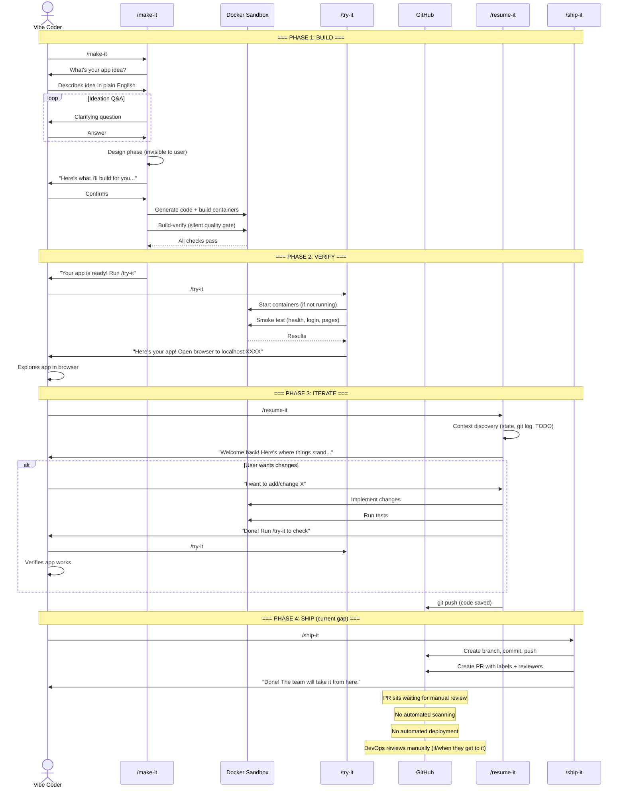
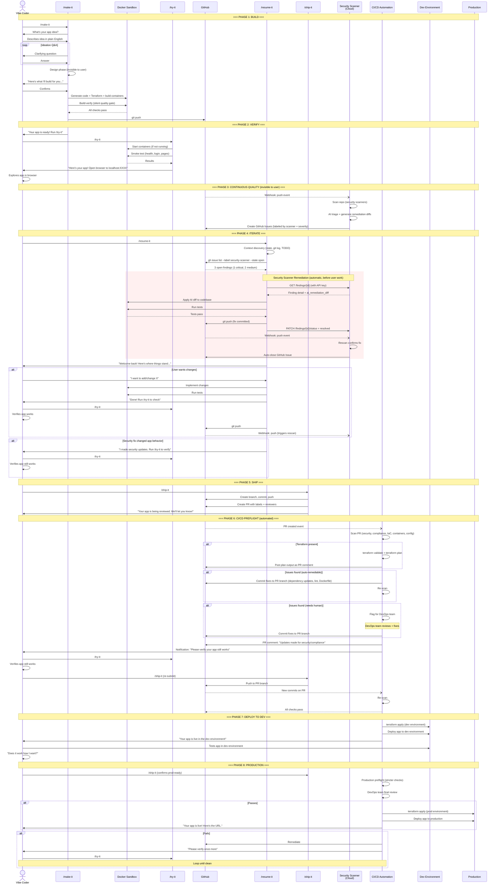
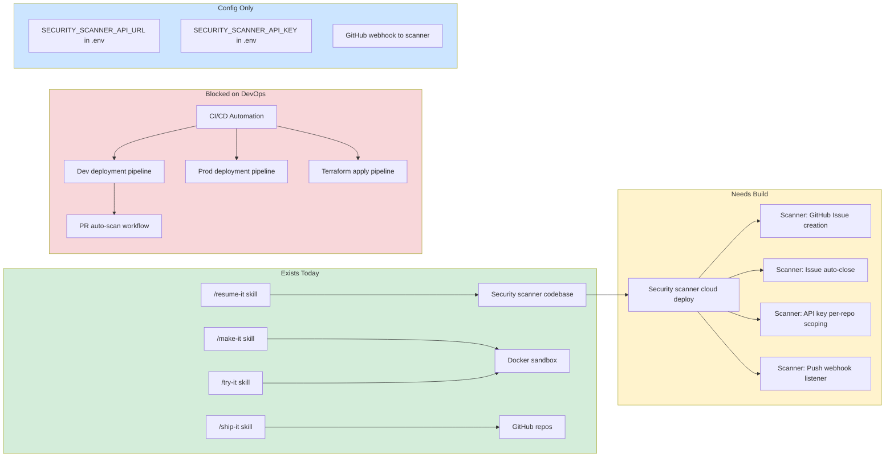
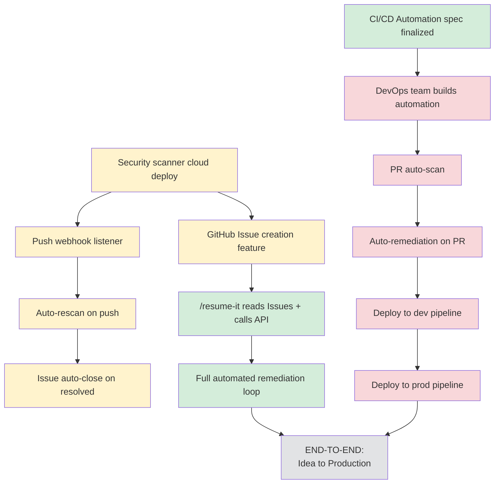

# Make-It Deployment Lifecycle -- Sequence Diagrams

## Current State (What Works Today)

No security scanner is deployed to the cloud. CI/CD automation does not exist. The user's world stops at /ship-it creating a PR -- everything after that is manual.

## Full Vision (Target State)

Security scanner deployed to cloud, scanning repos continuously. CI/CD automation operational. End-to-end from idea to production with the user only verifying at checkpoints.

## Gap Analysis

What exists today vs what's needed for the full vision.

## Dependency Chain (What Unblocks What)

### Legend

| Color | Meaning |
|-------|---------|
| Green | Exists or ready to wire up |
| Yellow | Needs build (security scanner features) |
| Red | Blocked on DevOps team |
| Gray | End goal |

### Critical Path

The two tracks are **independent** -- you don't need CI/CD automation to get the security scanner working, and vice versa:

**Track 1 (Security Scanner -- unblocked now):**
1. Deploy security scanner to cloud
2. Build GitHub Issue creation feature
3. Build push webhook listener + auto-rescan
4. Build issue auto-close on resolved
5. Add API key per-repo scoping
6. Wire up /resume-it (already coded in the contract)

**Track 2 (CI/CD Automation -- blocked on DevOps):**
1. Finalize CI/CD automation spec (contract is defined in ship-it-guide.md)
2. DevOps team builds automation
3. PR scanning pipeline
4. Dev/prod deployment pipelines
5. Terraform apply automation

**Track 1 delivers:** Automated security remediation loop (scanner finds -> /resume-it fixes -> rescan confirms)

**Track 2 delivers:** Automated deployment pipeline (PR -> scan -> remediate -> deploy)

**Together they deliver:** Idea to production with zero manual technical work from the user.
